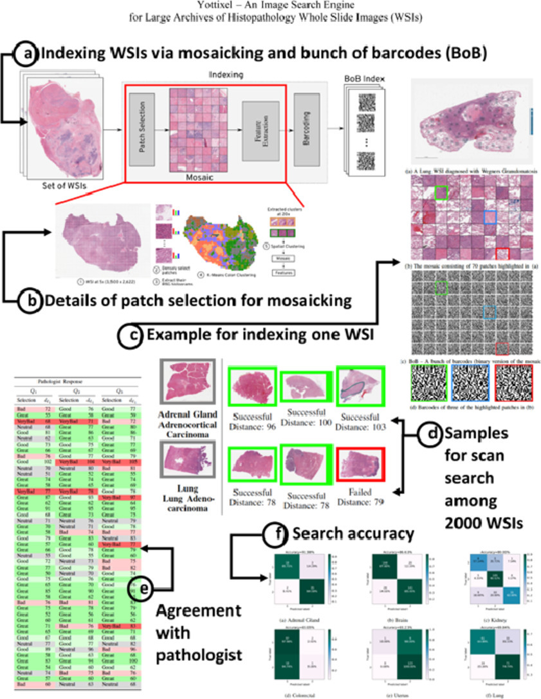

# Yottixel - A search engine for Digital Histopathology Archives
A system that comabines artificial intelligence (AI) with human knowledge promises faster and more accurate cancer diagnosis. Yottixel is a powerful image search engine, developed by a team led by researchers at Kimia Lab (University of Waterloo). Yottixel uses digital images of tissue samples to match new cases of suspected cancer with previously diagnosed cases in a database within a fraction of a second. The search engine is validated using a largest publicly available archive in the world - comprised of about 30,000 digitalied slides from almost 11,000 patients - the technology achieved high accuracy values (in some cases high 90s) for 32 forms of cancer in 25 organs and body parts. 

The major novelty of the Yottixel is the approach it uses for representing whole slide images (WSIs). Each WSI is converted to a set of representative patches that are converted into barcodes using deep models. These barcodes, called Bunch of Barcodes (BoB) are a compact form of characterization of a WSI. The BoB index requires less computation and storage resources for searching in large archives of histopathology slides compared to other approaches. For example, a WSI of size 200-300 MB can be converted to a BoB index of ~10 KB offering up to 99.9% reduction in its size.
### Paper Abstract
With the emergence of digital pathology, searching for similar images in large archives has gained considerable attention. Image retrieval can provide pathologists with unprecedented access to the evidence embodied in already diagnosed and treated cases from the past. This paper proposes a search engine specialized for digital pathology, called Yottixel, a portmanteau for “one yotta pixel,” alluding to the big-data nature of histopathology images. The most impressive characteristic of Yottixel is its ability to represent whole slide images (WSIs) in a compact manner. Yottixel can perform millions of searches in real-time with a high search accuracy and low storage profile. Yottixel uses an intelligent indexing algorithm capable of representing WSIs with a mosaic of patches which are then converted into barcodes, called “Bunch of Barcodes” (BoB), the most prominent performance enabler of Yottixel. The performance of the prototype platform is qualitatively tested using 300 WSIs from the University of Pittsburgh Medical Center (UPMC) and 2,020 WSIs from The Cancer Genome Atlas Program (TCGA) provided by the National Cancer Institute. Both datasets amount to more than 4,000,000 patches of 1000 × 1000 pixels. We report three sets of experiments that show that Yottixel can accurately retrieve organs and malignancies, and its semantic ordering shows good agreement with the subjective evaluation of human observers.
### Graphical abstract

### Versions
This repository includes two versions of the Yottixel code:
- yottixel_original includes the version that uses only DenseNet as a backbone.
- yottixel_modified includes the version that gives the option to use KimiaNet as a backbone.
### Useful Links
- [Yottixel Paper](https://www.sciencedirect.com/science/article/pii/S1361841520301213)
- [Learn more on Kimia Lab](https://kimialab.uwaterloo.ca/kimia/index.php/data-and-code-2/kimia-net/)
### Disclaimer
Rhazes Lab does not own the code in this repository. This code and data were produced in Kimia Lab at the University of Waterloo. The code is provided as-is without any guarantees, and is stored here as part of Kimia Lab's history. We welcome questions and comments.

Before using or cloning this repository, please read the [End User Agreement](agreement.pdf).